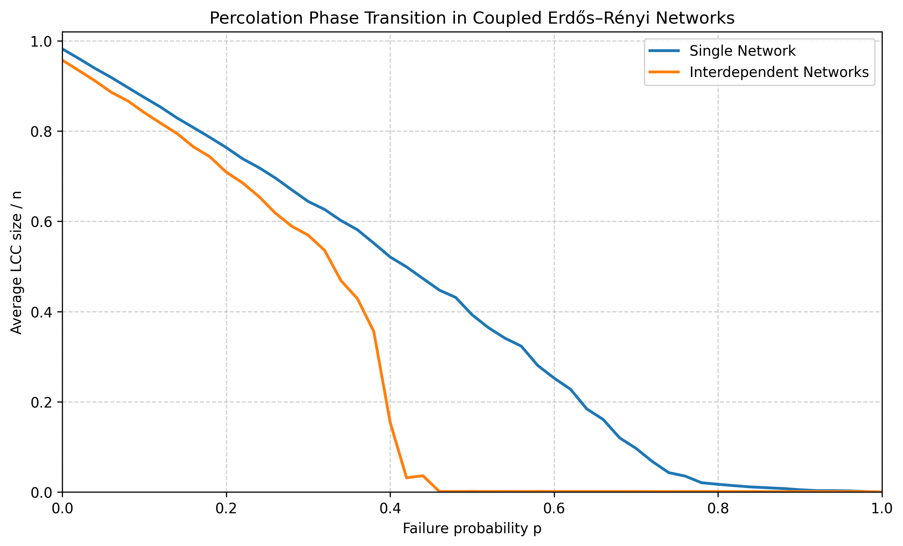
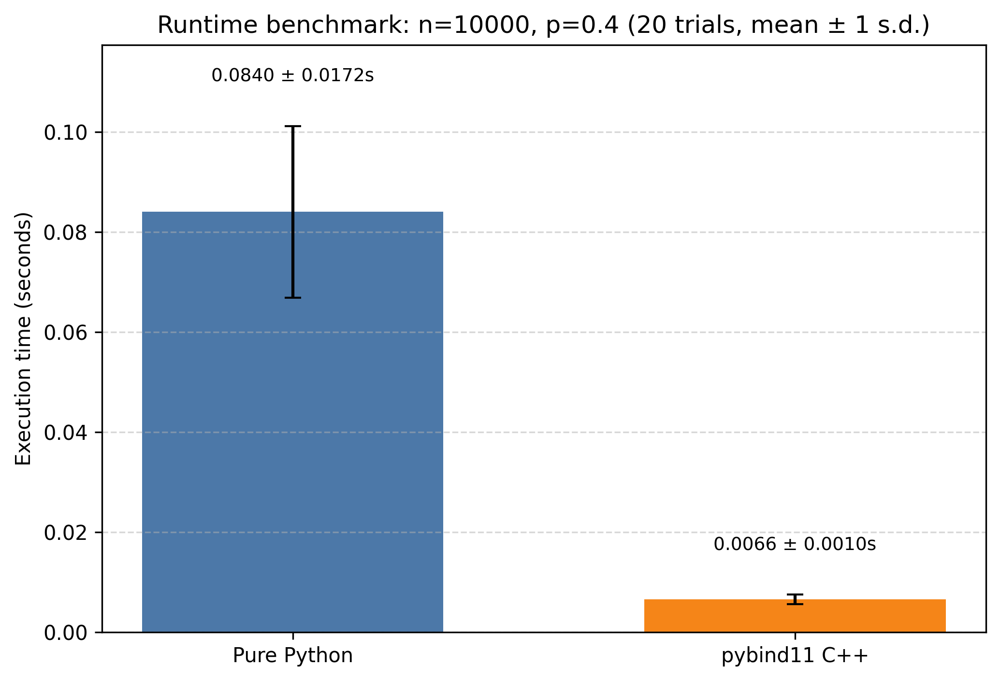

# Interdependent Network Percolation: A High-Performance C++/Python Simulation Engine

## Abstract / Overview

This project models cascading failures in **coupled complex networks** and studies how interdependence changes failure dynamics from a **second-order phase transition** (gradual degradation) to a **first-order phase transition** (abrupt systemic collapse).  

The implementation is intentionally hybrid: Python orchestrates experiments and visualization, while the cascade core is executed in C++ and exported to Python via `pybind11`. This removes major runtime overhead associated with Python-level object traversal in repeated Monte Carlo experiments by using a contiguous **adjacency-list** layout and low-level BFS. The same data structure family maps cleanly to **CSR**-style memory if you need zero-copy numeric kernels later.

## Theoretical Background

For an Erdős–Rényi random graph $G(n, p_e)$, each edge appears independently with probability:

$$
p_e = \frac{k}{n-1}
$$

where $k$ is the target mean degree.

In **site percolation**, a fraction $p$ of nodes is removed, and resilience is measured by the normalized size of the Largest Connected Component (LCC):

$$
S(p) = \frac{|LCC(p)|}{n}
$$

For a single network, $S(p)$ typically decays smoothly. In coupled networks with one-to-one dependencies, failures propagate across layers and trigger iterative dependency + connectivity pruning, which can induce discontinuous (first-order-like) collapse behavior.

## System Architecture

- **Python layer**
  - Generates ER graphs (`networkx`)
  - Runs Monte Carlo experiment grids
  - Produces publication-quality figures (`matplotlib`)
- **C++ layer (`pybind11`)**
  - Executes interdependent cascade kernel
  - Adjacency lists + BFS to compute the LCC under active-node bitmasks
  - Minimizes Python overhead in critical loops
- **Binding layer**
  - `PYBIND11_MODULE(cascade_sim, m)` exposes C++ functions as importable Python module APIs

## Visualizations

### Phase Transition: Single vs Interdependent Networks



*Figure 1. Normalized LCC size $S(p)$ versus failure probability $p$ (Erdős–Rényi graphs with $n = 10^{3}$, target mean degree $k = 4$; $p$ swept from $0$ to $1$ in steps of $0.02$; $10$ Monte Carlo samples per $p$). The “single network” curve is site percolation; the interdependent curve uses the C++ cascade engine. The single-network baseline degrades more gradually, while the coupled system shows a much sharper loss of giant-component mass.*

### Runtime Benchmark: Python vs C++ Engine



*Figure 2. Wall-clock time for one interdependent-cascade run at $n = 10^{4}$ and $p = 0.4$. Timings are repeated over many independent trials on the same underlying graph pair; the bar heights are the **sample mean**, and the error bars are **mean ± one sample standard deviation** (20 trials in the default `plot_cascade.py` run). The pybind11 C++ kernel is compared to the pure Python (NetworkX) interdependent implementation using identical per-trial seeds.*

## Installation & Build Instructions

**Recommended (editable install: builds `cascade_sim` and you can `import` it with no `PYTHONPATH` hacks):**

```bash
cd /Users/aliyazdanpanah/Work/site-percolation
python3 -m venv .venv
source .venv/bin/activate
pip install -U pip
pip install -e ".[dev]"
```

**Optional: reproduce figures with `make`**

```bash
make figures
# or, with the same venv:
python3 plot_cascade.py --help
python3 plot_cascade.py --seed 12345
```

**Alternative (CMake only, useful if you prefer an out-of-tree `build/` artifact):**

```bash
pip install "pybind11>=2.12"
cmake -S . -B build -Dpybind11_DIR="$(python3 -m pybind11 --cmakedir)"
cmake --build build -j
PYTHONPATH=build python3 plot_cascade.py
```

**Testing & static checks (local, no CI required):** run `pip install -e ".[dev]"` first so `cascade_sim` and dev tools are available, then:

```bash
make test
make ruff
```

Expected figure outputs (after `plot_cascade.py`):

- `figures/phase_transition.png`
- `figures/benchmark.png`

## Future work

- **GPU-accelerated Monte Carlo:** parallelize independent cascade realizations and parameter sweeps on CUDA (e.g. batched runs over seeds and $p$) to scale experiments to larger graphs and higher replication counts with minimal host–device transfer overhead.

## Author

Portfolio: [ali-yazdanpanah.github.io](https://ali-yazdanpanah.github.io/)
